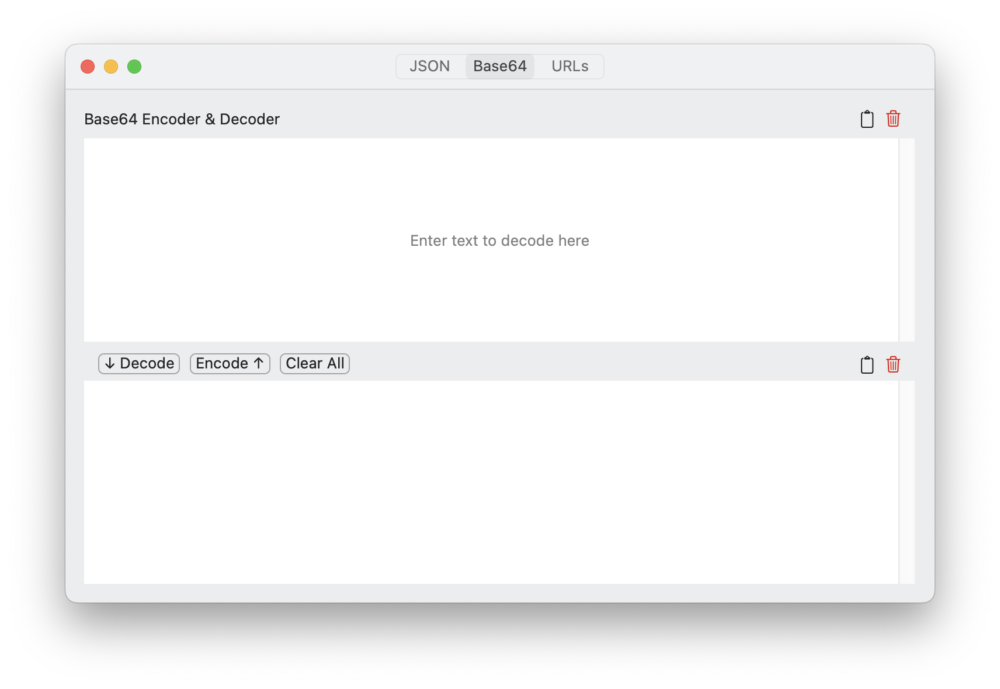

# Thelp
This macOS app provides various utilities for working with text. These are things I found myself going to random websites for and decided to make this simple app instead.

## Building the project
1. Requires Xcode 16.0 on macOS Sequoia or later.
2. Clone the repo.
3. In Terminal, navigate to the root of the repo and run this command:

```
cp Configuration-template.xcconfig Configuration.xcconfig
```

4. Update `Configuration.xcconfig`
  - Replace `YOUR_TEAM_ID` with your Team ID from Apple Developer Portal.
  - Update `PRODUCT_BUNDLE_IDENTIFIER` with desired Bundle ID.
5. Save changes to the file. The project should now build.
6. The `Configuration.xcconfig` is in the `.gitignore` file, so it won't be committed.


